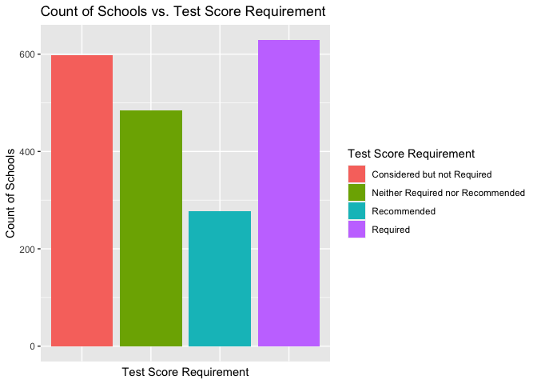

<!-- README.md is generated from README.Rmd. Please edit that file -->

# IPEDS 

<!-- badges: start -->

[](https://lifecycle.r-lib.org/articles/stages.html#experimental)
[](https://CRAN.R-project.org/package=IPEDS)
[](https://github.com/ajhaller/IPEDS/actions)
<!-- badges: end -->

`IPEDS` is a package that contains datasets from The Integrated
Postsecondary Education Data System (IPEDS). IPEDS is a system of
interrelated surveys conducted annually by the U.S. Department of
Education’s National Center for Education Statistics (NCES). IPEDS
annually gathers information from about 6,400 colleges, universities,
and technical & vocational institutions that participate in the federal
student aid programs.

## Installation

You can install the development version of IPEDS from
[GitHub](https://github.com/) with:

``` r
# install.packages("devtools")
devtools::install_github("ajhaller/IPEDS")
```

## Load

``` r
library(IPEDS)
```

## Available Tables

-   `adm2020`: dataset of Admissions and Test Scores for Fall 2020
-   `admin2020`: dataset of Administration for 2020
-   `complete2020`: dataset of Completions in 2020
-   `conference`: dataset of Conferences for sports (from
    `offerings2020`)
-   `dir_info2020`: dataset of Directory Information for 2020
-   `fall_enroll2020`: dataset of Fall Enrollment for 2020
-   `fin_aid1920`: dataset of Financial Aid Statistics for 2019-2020
-   `offerings2020`: dataset of Institutional Offerings for 2020
-   `relig_aff`: dataset of Religious Affiliations (from
    `offerings2020`, `relig_aff` column)
-   `staff_cat`: dataset of Staff Categories based on (from `admin2020`
    dataset, `staff_cat` column).

## Example: Admissions and Test Scores for Fall 2020

``` r
head(adm2020)
#>   INSTITUTION_ID   hs_gpa                          hs_rank   hs_record                    cprep_program                             recs                     competencies adm_tscores                      test_eng_FL                       other_test APPLCN APPLCNM APPLCNW ADMSSN ADMSSNM ADMSSNW ENRLT ENRLM ENRLW FT_enroll FT_enroll_M FT_enroll_W PT_enroll PT_enroll_M PT_enroll_W SAT_num SAT_pct ACT_num ACT_pct RW_SAT_25 RW_SAT_75 MTH_SAT_25 MTH_SAT_75 ACT_25 ACT_75 eng_ACT_25 eng_ACT_75 MTH_ACT_25 MTH_ACT_75
#> 1         100654 Required                      Recommended    Required                      Recommended Neither_required_nor_recommended                      Recommended    Required                         Required Neither_required_nor_recommended   9855    3394    6461   8835    2947    5888  1664   676   988      1622         660         962        42          16          26      22       1    1202      72       430       520        410        500     15     20         14         20         15         18
#> 2         100663 Required Neither_required_nor_recommended    Required                         Required Neither_required_nor_recommended Neither_required_nor_recommended    Required Neither_required_nor_recommended Neither_required_nor_recommended  10391    3803    6588   8375    3002    5373  2154   765  1389      2102         738        1364        52          27          25     302      14    2120      98       560       668        530        660     22     30         22         33         20         27
#> 3         100706 Required                      Recommended    Required Neither_required_nor_recommended Neither_required_nor_recommended                      Recommended    Required                         Required Neither_required_nor_recommended   5793    3057    2736   4467    2509    1958  1345   847   498      1328         840         488        17           7          10      90       7    1248      93       590       700        580        730     24     31         24         33         23         29
#> 4         100724 Required Neither_required_nor_recommended Recommended Neither_required_nor_recommended Neither_required_nor_recommended Neither_required_nor_recommended    Required                         Required Neither_required_nor_recommended   7027    2226    4763   6948    2188    4724   975   347   628       926         322         604        49          25          24     293      30     688      71       438       531        406        518     14     20         14         20         14         20
#> 5         100751 Required                      Recommended    Required                         Required Neither_required_nor_recommended Neither_required_nor_recommended    Required                         Required Neither_required_nor_recommended  39560   14907   24653  31804   12112   19692  6507  2752  3755      6466        2728        3738        41          24          17    1492      23    4986      77       540       660        530        670     23     31         23         33         21         29
#> 6         100830 Required                      Recommended    Required Neither_required_nor_recommended Neither_required_nor_recommended Neither_required_nor_recommended    Required                         Required Neither_required_nor_recommended   4606    1553    3053   4401    1473    2928   674   223   451       641         203         438        33          20          13      35       5     561      83       480       575        430        515     18     23         17         24         16         22
```

### Data Visualization

``` r
ggplot(adm2020, mapping = aes(x = adm_tscores, fill = adm_tscores)) +
  geom_bar() +
  labs(title = "Amount of Schools vs. Test Score Requirement",
       x = "Test Score Requirement",
       y = "Amount of Schools") +
  scale_fill_discrete(name = "Test Score Requirement",
                      labels = c("Considered_but_not_required" = "Considered but not Required",
                                 "Neither_required_nor_recommended" = "Neither Required nor Recommended")) +
  theme(axis.text.x=element_blank(),
        axis.ticks.x=element_blank())
```



## Example: Directory Information for 2020

``` r
head(dir_info2020) 
#>   INSTITUTION_ID                         INSTITUTION                        ADDRESS       CITY STATE        ZIP FIPS   BEA_REG AID_ELIG                    WEBSITE                                      ADMIN_WEB                                                                     FINAID_WEB                                                                   APPLICATION                                                        NPRICE_CALC                                            VET_TUITION                          ATH_GRAD_RATE                                                                 DISABILITY_WEB INT_LEVEL INT_CONTROL UNGRAD_OFFER GRAD_OFFER HD_OFFER HBCU HOSPITAL MEDICAL TRIBAL LOCALE OPENPUBL INT_STATUS CLOSE_DATE POST_SEC RPTMTH CC_U2018 CC_G2018 CC18_U_PROFILE CC18_ENROLL CC18_SIZE_SET C_PROGRAMS INT_SIZE MULT_ORG                    MULT_ORG_NAME MULT_ORG_CODE COUNTYCD          COUNTYNM CONGRESS_DIS_ID  LONGITUD LATITUDE
#> 1         100654            Alabama A & M University           4900 Meridian Street     Normal    AL      35762    1 Southeast        1              www.aamu.edu/ https://www.aamu.edu/admissions-aid/index.html                             https://www.aamu.edu/admissions-aid/financial-aid/ https://www.aamu.edu/admissions-aid/undergraduate-admissions/apply-today.html www.aamu.edu/admissions-aid/tuition-fees/net-price-calculator.html                                                                                               https://www.aamu.edu/administrativeoffices/VADS/Pages/Disability-Services.aspx         1           1            1          1       12    1        2       2      2     12        1         A          -2        1      1       16       17             10           4            14         16        3        2                               -2            -2     1089    Madison County             105 -86.56850 34.78337
#> 2         100663 University of Alabama at Birmingham Administration Bldg Suite 1070 Birmingham    AL 35294-0110    1 Southeast        1       https://www.uab.edu/       https://www.uab.edu/students/admissions/                                https://www.uab.edu/students/paying-for-college              https://ssb.it.uab.edu/pls/sctprod/zsapk003_ug_web_appl.new_user                   https://uab.studentaidcalculator.com/survey.aspx                  https://www.uab.edu/students/veterans https://www.uab.edu/registrar/students                                       https://www.uab.edu/students/disability/         1           1            1          1       11    2        1       1      2     12        1         A          -2        1      1       17       17              9           5            15         15        5        1 The University of Alabama System        101050     1073  Jefferson County             107 -86.79935 33.50570
#> 3         100690                  Amridge University                 1200 Taylor Rd Montgomery    AL 36117-3553    1 Southeast        1 www.amridgeuniversity.edu/          www.amridgeuniversity.edu/admissions/                                        www.amridgeuniversity.edu/financialaid/                         https://www2.amridgeuniversity.edu/Amridge/Login.aspx                                   www2.amridgeuniversity.edu:9091/         www.amridgeuniversity.edu/admissions/military/                                                                                  www.amridgeuniversity.edu/academics/         1           2            1          1       12    2        2       2      2     12        1         A          -2        1      1       19       18              5           5             6         51        1        2                               -2            -2     1101 Montgomery County             102 -86.17401 32.36261
#> 4         100706 University of Alabama in Huntsville                301 Sparkman Dr Huntsville    AL      35899    1 Southeast        1               www.uah.edu/                 https://www.uah.edu/admissions                                                                finaid.uah.edu/                                                             register.uah.edu/                                                    finaid.uah.edu/ www.uah.edu/admissions/graduate/financial-aid/veterans                       www.uah.edu/heoa                             www.uah.edu/health-and-wellness/disability-support         1           1            1          1       11    2        2       2      2     12        1         A          -2        1      1       17       17             15           4            12         16        3        1 The University of Alabama System        101050     1089    Madison County             105 -86.64045 34.72456
#> 5         100724            Alabama State University           915 S Jackson Street Montgomery    AL 36104-0271    1 Southeast        1             www.alasu.edu/            www.alasu.edu/admissions/index.aspx www.alasu.edu/undergraduate/expensesandfinancialaid/expenses-and-financial-aid                      www.alasu.edu/admissions/undergrad-admissions/index.aspx          www.alasu.edu/cost-aid/tuition-costs/net-price-calculator                                                          www.alasu.edu/cost-aid/consumer-info www.alasu.edu/academics/researchcenters/alabama-alliance-students-disabilities         1           1            1          1       11    1        2       2      2     12        1         A          -2        1      1       13       13             10           3            14         21        2        2                               -2            -2     1101 Montgomery County             107 -86.29568 32.36432
#> 6         100733 University of Alabama System Office      500 University Blvd. East Tuscaloosa    AL      35401    1 Southeast        2          www.uasystem.edu/                                                                                                                                                                                                                                                              www.uasystem.edu/                                                                                                                                                            www.uasystem.edu/         1           1            1          1       11    2       -2      -2      2     12        1         A          -2        1     -2       -2       -2             -2          -2            -2         -2       -2        1 The University of Alabama System        101050     1125 Tuscaloosa County             107 -87.52959 33.20701
```

## Functionality

``` r
admission_reqs # extracts admission requirements for any institution
acceptance_rate # calculates acceptance rate for any institution
school_preferences # provides a dataset of institutions according to your preferences
compare_int # function allows comparison of two institutions and its important qualities 
read_data # function for importing raw data from IPEDS
```

``` r
admission_reqs(167835)
#> The Requirements for Smith College are: 
#> # A tibble: 9 × 2
#>   Requirements                            Priority                        
#>   <chr>                                   <chr>                           
#> 1 High School Record                      Required                        
#> 2 Completion of College-Prepatory Program Required                        
#> 3 Recommendations                         Required                        
#> 4 High School GPA                         Recommended                     
#> 5 High School Rank                        Recommended                     
#> 6 Test of English as a Foreign Language   Recommended                     
#> 7 Formal Demonstration of Competencies    Neither_required_nor_recommended
#> 8 Admission Test Scores                   Neither_required_nor_recommended
#> 9 Other Tests                             Neither_required_nor_recommended
```

``` r
school_preferences(financial_aid = 70, size = 2, region = "New England", diversity_staff = 27)
#>                            Institution Institution ID % of Students Recieved Aid Institution Size Student Diversity Staff Diversity % of Students Disabled      Region Type of Institution Religious Affiliation Calendar System Open Admissions Policy Years Required For Entering       Vet Programs     Alternative Credit   Alternative Tuition Payment                         Distance Education        Counseling Services        Employment Services           Daycare Services Live On-Campus Room Price Board Price Undergraduate Application Fee Graduate Application Fee
#> 1 Eastern Connecticut State University         129215                         79                2                31              34                      2 New England                   1                    -2               1                      2                          -2 Programs Available Takes alternate credit Takes alternate tuition plans    Offers distance education opportunities Offers counseling services Offers employment services Offers no daycare services              2       8270        6164                            50                       50
#> 2                     Clark University         165334                         91                2                42              31                      2 New England                   3                    -2               1                      2                          -2 Programs Available Takes alternate credit Takes alternate tuition plans    Offers distance education opportunities Offers counseling services Offers employment services Offers no daycare services              2       5800        4000                             0                       75
#> 3                Mount Holyoke College         166939                         76                2                55              37                      2 New England                   3                    -2               1                      2                          -2 Programs Available Takes alternate credit Takes alternate tuition plans    Offers distance education opportunities Offers counseling services Offers employment services Offers no daycare services              2       7860        8160                            60                       50
#> 4                        Smith College         167835                         71                2                51              27                      1 New England                   3                    -2               1                      2                          -2 Programs Available Takes alternate credit Takes alternate tuition plans Offers no distance education opportunities Offers counseling services Offers employment services Offers no daycare services              2       9400        9360                             0                       60
```

``` r
acceptance_rate(167835)
#> # A tibble: 1 × 2
#>   Institution   Acceptance_Rate
#>   <chr>                   <dbl>
#> 1 Smith College              37
```

For further examples and capabilities, please see the
[vignette](https://github.com/ajhaller/IPEDS/blob/main/vignettes/IPEDS-vignette.Rmd)

## Contributors

-   [Aushanae Haller](https://github.com/ajhaller)
-   [Alejandra Munoz Garcia](https://github.com/alejanmg)
